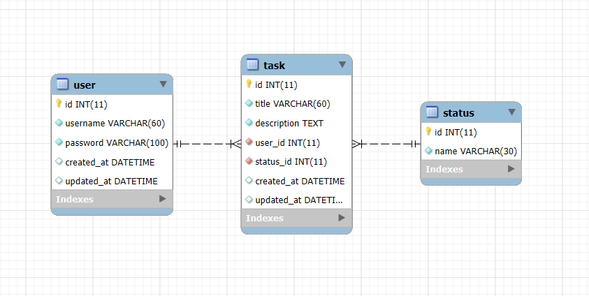

# Prueba PHP sin framework
Este proyecto se desarrolló sin el uso de frameworks en PHP. Se empleó una arquitectura MVC para gestionar el proyecto de manera eficiente y mantener buenas prácticas de desarrollo. Además, se utilizó la programación orientada a objetos (POO) para las clases relacionadas con las bases de datos, emulando un tipo de ORM.
<div style="text-align: center;">

</div>

## Requerimientos
<div style="text-align: center;">
  %208-4F5D95?style=flat-square&logo=PHP&logoColor=white" alt="PHP">
  
  
</div>

## Estructura del proyecto
El proyecto utiliza MySQL como soporte para la base de datos. El archivo sql.sql contiene la base de datos, la cual está lista para ser importada.

### Descripción de Directorios y Archivos Clave

- **`app/`**: Contiene los controladores, la conexión a la base de datos, modelos, recursos y funciones generales.
  - `controller`: Contiene los controladores del proyecto.
  - `core`: Contiene el archivo de conexión a la base de datos.
  - `models`: Contiene los modelos para obtener los datos de la base de datos.
  - `resources`: Contiene las vistas en `.php` de cada módulo.
  - `functions.php`: Contiene funciones para la encriptación, desencriptación y la validación de la sesión para cada ruta.
- **`public/`**: Contiene los archivos y librerías del proyecto.
  - `css`: Contiene los estilos de la página.
  - `img`: Contiene las imágenes del proyecto.
  - `js`: Contiene los archivos JavaScript para las validaciones de los formularios y las peticiones al PHP.
- **`index.php`**: Archivo de entrada principal donde se manejan las rutas.
- **`sql.sql`**: Archivo de la base de datos.
- **`loadEnv.php`**: Archivo con las variables de entorno.
- **`.htaccess`**: Configuración para que el proyecto en PHP pueda usar rutas amigables.
- **`model.mwb`**: Modelo entidad relación de la base de datos hecho en Mysql Workbench.
  


## Rutas del proyecto
### Inicio de sesion
- `GET /` - Muestra la vista para iniciar sesión con las credenciales del usuario.
- `POST /` - Valida las credenciales para iniciar sesión.
### Crear usuario
- `GET /user` - Muestra la vista para crear un nuevo usuario.
- `POST /user` - Crea un nuevo usuario con 'username' y 'password'.
  
### Tareas
- `GET /task` - Muestra la vista de las tareas y obtiene la lista de tareas.
- `GET /task?id={id}` - Obtiene una tarea por su ID.
- `POST /task` - Crea una nueva tarea.
- `PATCH /task` - Actualiza una tarea existente.
- `DELETE /task` - Elimina una tarea.

### Cerrar sesion
- `POST /logout` - Cierra la sesión del usuario y redirige al inicio de sesión.

### Estatus
- `GET /status` - Obtiene los estatus de las tareas.


## Base de datos 
El proyecto utiliza MySQL como sistema de gestión de bases de datos. El archivo `sql.sql` contiene la estructura de la base de datos, la cual está lista para ser importada. La base de datos incluye tres tablas:

- **`user`**: Usuarios del sistema.
- **`task`**: Tareas.
- **`status`**: Estado de las tareas.




## Instrucciones de configuración

Sigue estos pasos para poner el proyecto PHP en XAMPP usando MySQL.

### 1. Instalar XAMPP

1. Descarga XAMPP desde [apachefriends.org](https://www.apachefriends.org/es/index.html).
2. Sigue las instrucciones de instalación para tu sistema operativo.

### 2. Iniciar XAMPP

1. Abre el panel de control de XAMPP.
2. Inicia los módulos **Apache** (servidor web) y **MySQL** (servidor de base de datos).

### 3. Preparar tu Proyecto

1. Coloca tu proyecto PHP en la carpeta `htdocs` de XAMPP.
   - En Windows: `C:\xampp\htdocs`
   - En macOS: `/Applications/XAMPP/htdocs`

### 4. Crear la Base de Datos

1. Abre tu navegador y ve a `http://localhost/phpmyadmin`.
2. Haz clic en **Importar** que esta en la parte superior del menu.
3. Importa el archivo `sql.sql` que viene en el proyecto y selecciona **Importar**
### 5. Accede al proyecto
1. En el navegador, ve a http://localhost/php-challenge para ver el proyecto en acción.

## Seguridad en el proyecto

Este proyecto de PHP utiliza variables de entorno definidas en un archivo `.env` para almacenar información sensible, como credenciales de la base de datos, la URL base del proyecto y una clave para encriptación. **No es necesario crear el archivo `.env` en este proyecto de prueba, ya que las variables están hardcodeadas en el archivo `/loadEnv.php`**. 

Sin embargo, es importante destacar que, en un proyecto real, estas variables deben definirse únicamente en el archivo `.env` y no ser hardcodeadas en el código fuente por razones de seguridad.

## Variables de Entorno

El archivo `.env` no está incluido en el repositorio por motivos de seguridad, pero se puede crear manualmente en la raíz del proyecto con las siguientes variables de ejemplo:


```env
DB_HOST=localhost
DB_NAME=challengeDb
DB_USER=root
DB_PASS=
BASE_URL=php-challenge
KEY_ENCRYPTER=aeQejNaDKSN@!-f
```

Estas variables corresponden a la configuración predeterminada de XAMPP. 

**Si utilizas un valor diferente para tu servidor XAMPP, asegúrate de crear el archivo `.env` y actualizar los valores según sea necesario.**
